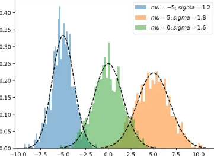
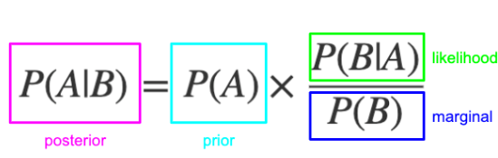

## <ins> Gaussian Mixture Models
A **GMM** is a probabilistic model that assumes that the data is generated from a mixture of several Gaussian distributions, each with its own mean and covariance.

<p align="center">
  
</p>

The algorithm iterates trough an Expectation and a Maximization step trying to optimize/maximize an objective function.

The problem with simple Gaussian models is that a single distribution cannot cover the whole data distribution.

We consider that different clusters contain datapoints that come from different Gaussians. However the Gaussians may have overlapping regions. This means for example that a datapoint that sits in the space where the tails of two Gaussians overlap there is a probability that it can be sampled from the one and the probability that it can be sampled from the other one.

\( π_k \) represents the prior probability that a randomly selected datapoint comes from Gaussian \(k\).

\(π_k=P(z=k)\), where \(z\) is a latent variable which represents the cluster where the datapoint comes from.

It is called latent because we never observe the variable we only observe the datapoints.

So the probability of observing a datapoint is the following:
```math
p(x)=\sum_{k=1}^{K}\pi_k\,\mathcal{N}(x\mid\mu_k,\Sigma_k)
```

### <ins> Model Training / Estimating Model Parameters

Model training in GMM refers to the process of estimating the parameters πκ for each Gaussian and the mean and covariance matrix of each Gaussian.

Initialize the model parameters. This can be done randomly or using a hard cluster assigning algorithm like kmeans clustering.

First for each datapoint we compute the responsibilities. 
Which translates to “”Given my current Gaussians, what is the probability that Gaussian k generated this point?“”

```math
\gamma(z_{nk})
=
P(z_n = k \mid x_n)
```

Using the Bayes rule:

<p align="center">
  
</p>

we get:

```math
P(z = k \mid x)
=
\frac{\pi_k \mathcal{N}(x_n \mid \mu_k, \Sigma_k)}
{\sum_{j=1}^{K} \pi_j \mathcal{N}(x_n \mid \mu_j, \Sigma_j)}
```

From the numerator the \(P(z = k)\) is the mixing coefficient πκ and the probability of x given the actual cluster that is assigned to is the gaussian of that cluster so we get:

```math
P(x_n \mid z = k)\,P(z = k)
=
\mathcal{N}(x_n \mid \mu_k,\Sigma_k)\,\pi_k
```

For the denominator now we are looking for the total(marginal) probability of observing \(x\), which is actually the mixture of all the gaussians:


```math
P(x_n)
=
\sum_{j=1}^{K}
\pi_j\,\mathcal{N}(x_n \mid \mu_j,\Sigma_j)
```
Bringing everything together we have the responsibilities in the form:


```math
\gamma_{nk}
=
\frac{\pi_k\,\mathcal{N}(x_n \mid \mu_k,\Sigma_k)}
{\sum_{j=1}^{K}\pi_j\,\mathcal{N}(x_n \mid \mu_j,\Sigma_j)}
```

 <ins> **This is the E step of the EM algorithm**

To this point we have the datapoints and defined values for the parameters πκ, mean and variance.

For the maximization step now we take the likelyhood of the data, meaning the probability of observing the data that we have based on the parameters we have.

For the Gaussian Mixture Models and of course considering that all the datapoints are IDD the log likelyhood is the following:
\[
\log p(X \mid \theta)
= \sum_{n=1}^{N} \log \left( \sum_{k=1}^{K} \pi_k \, \mathcal{N}(x_n \mid \mu_k, \Sigma_k) \right)
\]


- where N refers to the total number of datapoints
- K again refers to the total number of Gaussians/Clusters

The problem however with this likelyhood is that the summation makes the maximization very difficult because each datapoint comes from a mixture of Gaussians.

In order to solve this problem we introduce the set of z variable

So now we need to optimize:

\[
\max_{\theta} \log p(X, Z \mid \theta)
\]
which is equal to :

\[
p(X, Z \mid \theta)
= \prod_{n=1}^{N} p(z_n \mid \pi)\, p(x_n \mid z_n, \mu, \Sigma)
\]
But again know we introduce a variable z that we do not know its distribution and values since we do not observe it.

Here comes a key statistical principle that states that:

**If a variable is unknown, replace it with its expectation under its posterior distribution.**

So we get.

\[
\gamma_{nk} \equiv \mathbb{E}[z_{nk}] = p(z_n = k \mid x_n, \theta^{old})
\]
And know since znk takes only values {1,0}, 1 if the datapoint belongs to the cluster and 0 otherwise.

So overall we have:

\[
\mathbb{E}[z_{nk}] = p(z_n = k \mid x_n, \theta^{old})
\]

And we replace znk with the responsibilities.

The final result is an objective function where when we maximize with respect to each one of the 3 parameters we cat three formulas that give the values that we need to update the parameters of the model.
\[
\pi_k = \frac{N_k}{N}
\] where:
\[
N_k = \sum_{n=1}^{N} \gamma_{nk}
\]

**Update the Means of the components**

The new mean for component k(gaussian distribution) is the weighted average of the data points, weighted by the responsibilities:

\[
\mu_k = \frac{1}{N_k} \sum_{n=1}^{N} \gamma_{nk} x_n
\]
**Update covariances**

\[
\Sigma_k
= \frac{1}{N_k}
\sum_{n=1}^{N} \gamma_{nk}
(x_n - \mu_k)(x_n - \mu_k)^T
\]

<br>
<br>
<br>

<p align="center">
  <b>Example clustering</b>
</p>

<br>

<p align="center">
  

  <em>Clustering of generated data using KMeans and GMM algorithms. On the left the KMeans algorithm is used and on the right a KMeans initialized GMM algorithm is used.</em>
</p>